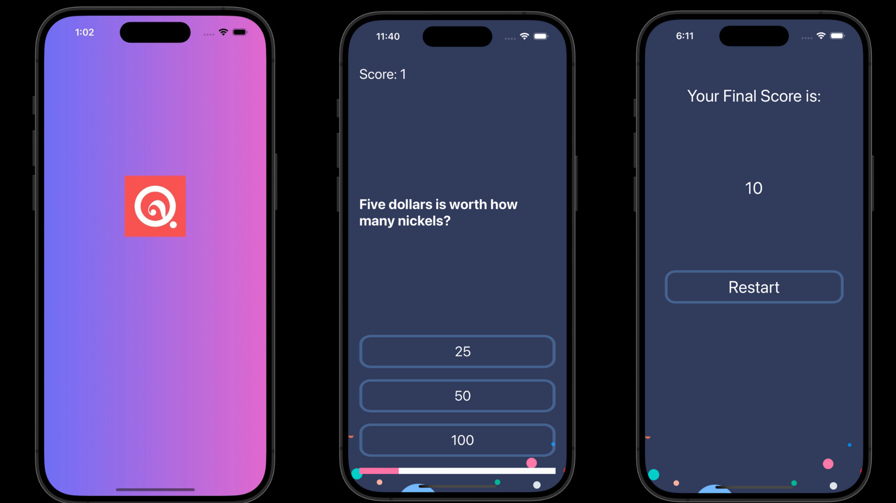

# Quizzler

Quizzler is a quiz app that allows users to attempt quizzes and receive real-time scores and feedback. The app provides immediate feedback on whether each question is answered correctly, enhancing the learning experience by reinforcing correct answers and identifying mistakes instantly.

## Features

- **Static Quiz Content**: Users can attempt predefined quizzes.
- **Real-Time Scoring**: Immediate scoring upon quiz completion.
- **Instant Feedback**: Real-time feedback after each question, indicating whether the answer is correct or incorrect.
- **User-Friendly Interface**: Simple and intuitive interface for easy quiz-taking.

## Screenshots



## Technologies Used

- **Swift**: Clima is developed using the Swift programming language using UIKit framework.
- **UIKit**: UI components and interface elements are built using UIKit framework.

## Installation

To run Clima locally, follow these steps:

1. Clone the repository:

    ```bash
    git clone https://github.com/RGisanEclipse/Quizzler.git
    ```

2. Open the project in Xcode:

    ```bash
    cd Quizzler
    open Quizzler.xcodeproj
    ```

5. Build and run the project in Xcode.

## Contributing

Contributions are welcome! If you'd like to contribute to Quizzler, please fork the repository and create a pull request with your changes.